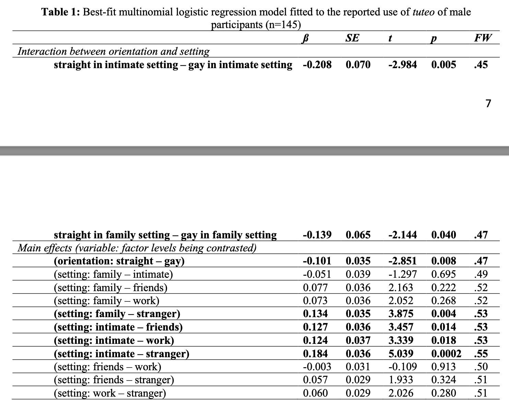
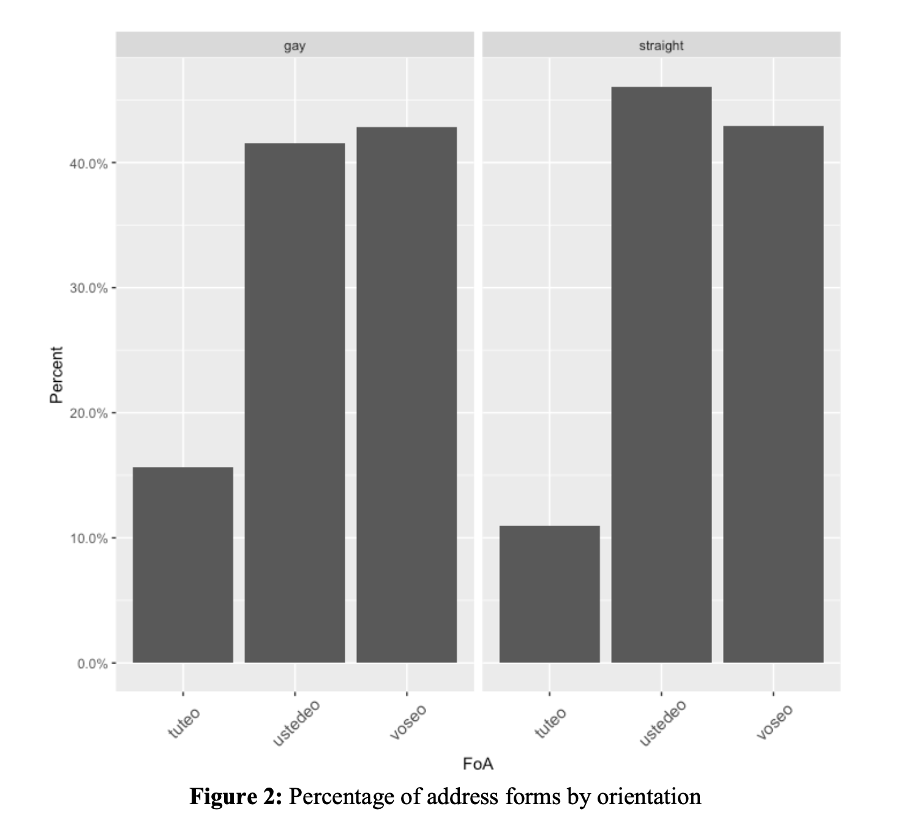

#Summary of main points and main research question
- The use of *tuteo*, *voseo* and *ustedeo* in Costa Rica has changed over the years.

- The authors study the current distribution for these forms among heterosexual men, straight women, and gay men.

- I will focus my report on one research question: Is the likelihood of using *tuteo* different between gay and straight men?
---
#Methods
- The authors carried out a three-part survey on Qualtrics.

- The participants were 21 were gay men and 23 straight men.

- Participants were accorded age ranges (young, adult, older) using an emic approach. 

- They ran a multinomial logistic regression to assess the likelihood of the uses of *tuteo*,*ustedeo*, and *voseo*.

- They identified the independent variable (gay or straight men), and the dependent variable (if they used each form of address).

- They conducted multinomial logistic regression because there are three possible outcomes between the two groups.

- Additionally, they considered different settings (family, friends, and work) to assess  in which setting they used it. These factors were coded as dummy variables.    

---
#Appropriateness/novelty of the analysis
- Formal statistical analysis has only recently gained momentum in Sociolinguistics.

- This approach is appropriate because they aimed to answer a yes/no question, which is binary in nature, so logistic regression is the best fit for this kind of data, but in this case was multinomial logistic regression because of the three categories.

---
#Presentation of results

- The authors accurately presented the results because they included statistical reports for each group in different settings. They also included a table with coefficient information, standard error, t-ratios, p-values, and factor weights (see next slide).

- The coefficients indicate in which group the use of *tuteo* is more likely.

- The negative coefficient in gay men in intimate setting shows that they are less likely
---
Table 1 

---
Figure 2 shows the use of *tuteo* is quite similar for gay and straight men.

---
#What I liked and did not like

- I liked this article because it shows that the perceptions about the use of *tuteo* among gay and straight men do not reflect the actual use. The study also found that gay men actually prefer *ustedeo* and *voseo*.

- I liked that the multinomial logistic regression allows to observe interactions between the uses of *tuteo* and the type of setting. I used to believe logistic regression could only happen between two possible outcomes, but multinomial allows to include more options.

- It was difficult to sift through all the data.

